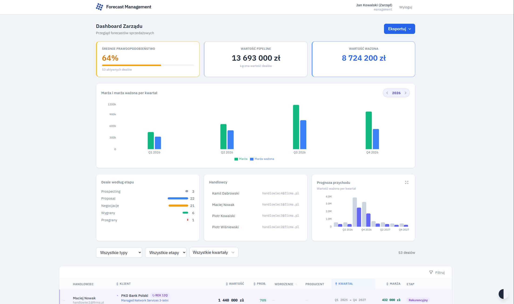
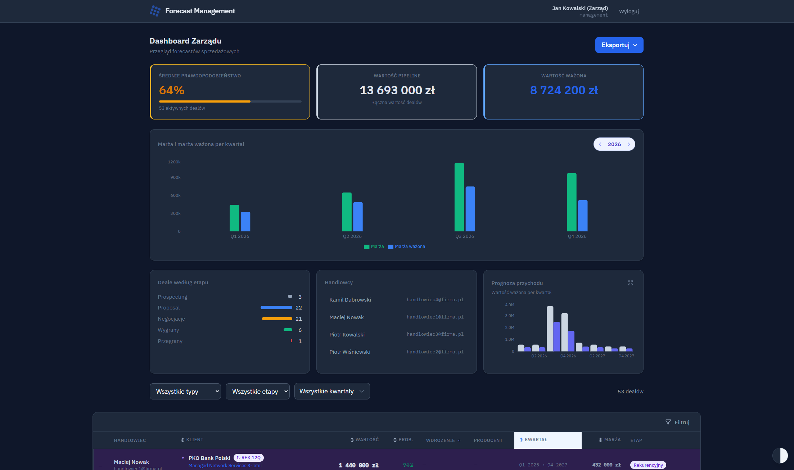
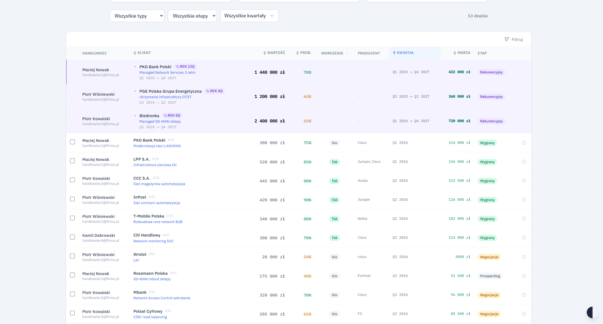
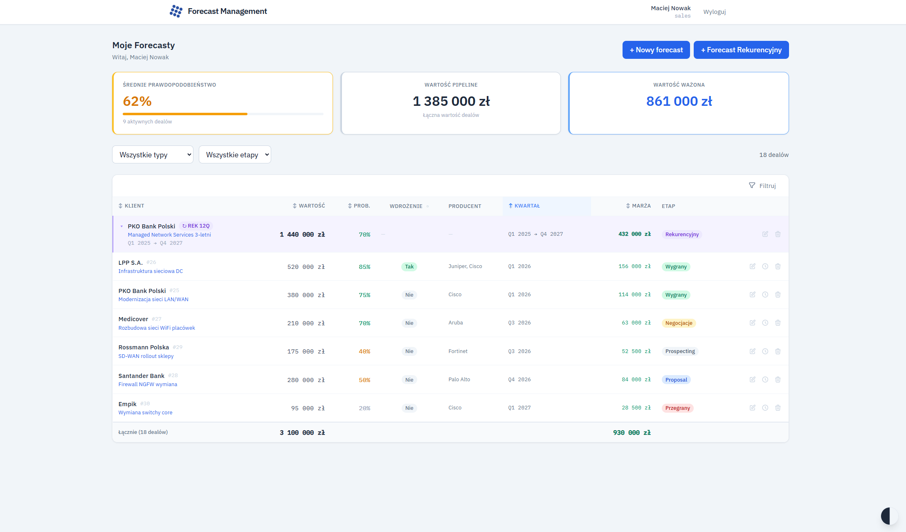
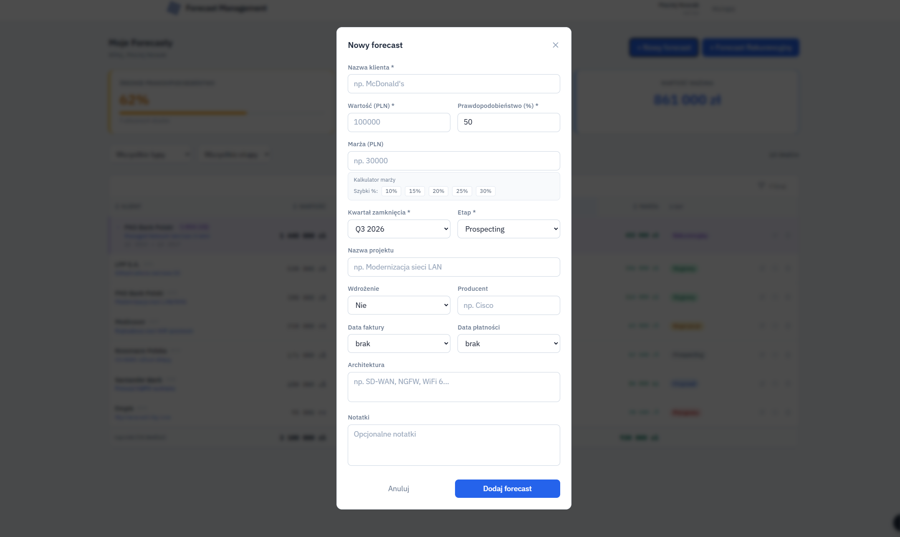
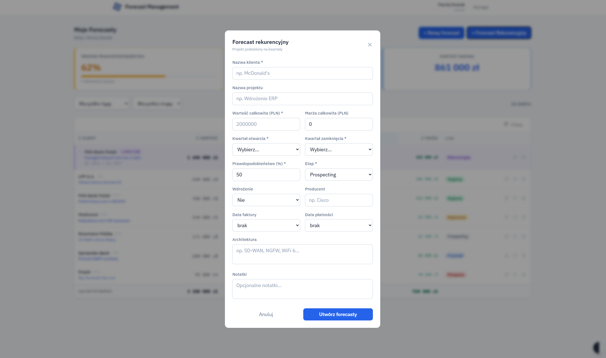

# Forecast Management

Internal web application for sales pipeline management, built for a company's sales team and management.

## Features

- **Sales dashboard** — add, edit and track deals with full audit trail (change history per forecast)
- **Management dashboard** — overview of all salespeople's pipelines, revenue charts, weighted margin charts
- **Recurring forecasts** — group deals across quarters, edit single quarter or entire group at once
- **Column-level sorting** — click any column header to sort (client, value, probability, quarter, margin)
- **Filtering** — by stage, quarter (multi-select with year toggle), salesperson, deal type, deployment status
- **Checkbox selection** — select individual forecasts and get instant sum of value, margin and weighted margin
- **Export** — XML and CSV export for management
- **Role-based access** — `SALES` role sees only own deals, `MANAGEMENT` sees everything
- **Dark mode**
- **Change history** per forecast

## Screenshots

### Management Dashboard




### Sales Dashboard




## Tech Stack

| Layer | Technology |
|---|---|
| Frontend | React 18, Vite, Tailwind CSS, Recharts |
| Backend | Python 3.11, FastAPI, SQLAlchemy |
| Database | PostgreSQL 16 |
| Auth | JWT (HS256), bcrypt |
| Infrastructure | Docker Compose, Nginx |

## Getting Started

### Prerequisites

- Docker Desktop

### Run locally

```bash
git clone https://github.com/PatrykKonkolewski/forecast-management.git
cd YOUR_REPO

# Copy and configure environment variables
cp .env.example .env

docker compose up --build -d
docker compose exec backend python migrate.py
docker compose exec backend python seed.py
```

App available at `http://localhost`

### Environment variables

Create a `.env` file based on `.env.example`:

```
SECRET_KEY=your_secret_key
POSTGRES_USER=forecast_user
POSTGRES_PASSWORD=your_password
POSTGRES_DB=forecast_db
```

## Project Structure

```
Forecast/
├── docker-compose.yml
├── backend/
│   ├── app/
│   │   ├── api/          # auth, forecasts, users endpoints
│   │   ├── core/         # config, database, security
│   │   ├── models/       # SQLAlchemy models
│   │   ├── schemas/      # Pydantic schemas
│   │   └── services/     # audit trail service
│   ├── migrate.py
│   └── seed.py
└── frontend/
    └── src/
        ├── components/   # ForecastTable, modals, charts
        ├── pages/        # SalesDashboard, ManagementDashboard, LoginPage
        ├── store/        # AuthContext
        └── utils/        # API client, formatters
```

## API

14 REST endpoints. Key ones:

| Method | Endpoint | Access |
|---|---|---|
| POST | `/api/forecasts` | SALES |
| GET | `/api/forecasts/my` | SALES |
| GET | `/api/forecasts` | MANAGEMENT |
| GET | `/api/forecasts/management/stats` | MANAGEMENT |
| GET | `/api/forecasts/management/export/xml` | MANAGEMENT |
| GET | `/api/forecasts/{id}/history` | AUTH |